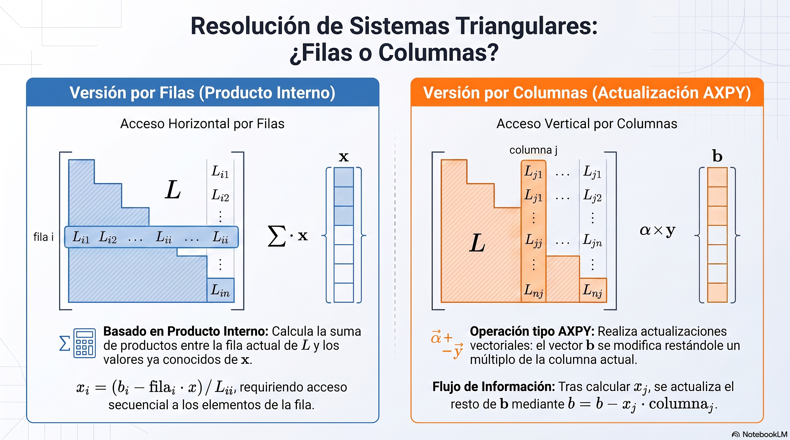

# Análisis Numérico II / Álgebra Lineal Numérica
## Clase 01: Motivación y Preliminares

---

# Primero lo administrativo

## Quiénes somos?

### Luis Biedma (Teóricos): lbiedma@unc.edu.ar - Of. 309
- Dr. en Matemática
- Profesor Adjunto GANyC - FAMAF
- Secretario de Innovación y Vinculación Tecnológica FAMAF

### Claudio Armas (Prácticos): claudio.armas@unc.edu.ar - Of. 324
- Doctorando en Matemática
- Profesor Asistente GANyC - FAMAF

---

# Primero lo administrativo

## Bibliografía - Vamos a seguir las:

- [*Notas de Análisis Numérico II*](https://drive.google.com/file/d/1bR-cXuGGTgFfpr2GrrOI6cNIG6Ue0RBu/view?usp=sharing) de Damián Férnandez como base.

## Con cositas de:
- [*Linear Algebra and Learning from Data*](https://math.mit.edu/~gs/learningfromdata/) de Gilbert Strang.
- [*Advanced Linear Algebra: Foundations to Frontiers*](https://www.cs.utexas.edu/~flame/laff/alaff/ALAFF.html) de la University of Texas.
- [*CME 302: Numerical Linear Algebra*](https://ericdarve.github.io/NLA/content/intro.html) de la University of Stanford.

---

# Primero lo administrativo
### Días y Horarios: Miércoles y Viernes de 9 a 13hs en Laboratorio 28
## Evaluación
- 2 Parciales, 1 Recuperatorio, 1 Proyecto
- Para Promocionar
    - Aprobar los 2 parciales o 1 parcial y 1 recuperatorio con promedio $>=7$ y ninguna nota menor a 6
    - Presentar el Proyecto Final (en grupos de 2 personas)
- Para Regularizar
    - Aprobar los 2 parciales o 1 parcial y 1 recuperatorio
    - Presentar el Proyecto Final (en grupos de 2 personas)

---

# Vamos a lo nuestro: Qué es el Álgebra Lineal Numérica?

Se enfoca en una pregunta central:
**¿Cómo realizamos computaciones matriciales con una velocidad y precisión aceptables?**

A diferencia del álgebra lineal teórica, aquí nos preocupamos por:
- **Eficiencia:** Algoritmos que escalan con datos masivos.
- **Estabilidad:** Cómo afectan los errores de redondeo al resultado.
- **Memoria (en menor medida):** Uso óptimo del hardware (CPUs/GPUs).

---

# Motivación: Aplicaciones Reales

El Álgebra Lineal Numérica es el motor de tecnologías modernas:

1. **Modelado de Temas (NLP):** Uso de SVD y NMF para identificar temas en documentos.
2. **Visión por Computadora:** Eliminación de fondo en videos mediante PCA Robusto.
3. **Salud:** Reconstrucción de imágenes de tomografía computarizada (CT) con *Compressed Sensing* para reducir la radiación.
4. **Buscadores:** El algoritmo PageRank de Google se basa en el cálculo de autovalores de matrices masivas.

---

# Motivación: Aplicaciones en Ingeniería

Las fuentes de Watkins y Darve destacan su uso en:

- **Circuitos Eléctricos:** Cálculo de voltajes y corrientes resolviendo sistemas lineales.
- **Sistemas Masa-Resorte:** Análisis de equilibrio elástico y vibraciones.
- **Ecuaciones Diferenciales:** Resolución numérica de modelos de transferencia de calor y dinámica poblacional.

---

# Preliminares: Notación Básica

- **Conjuntos:** $\mathbb{R}$ (reales), $\mathbb{C}$ (complejos), $\mathbb{N}$ (naturales) y $\mathbb{Z}$ (enteros).
- **Sucesiones:** $\{\alpha_k\}$, $\{\alpha_k\}_{k=0,1}^\infty$
- **Vectores y Espacios Vectoriales:** $\mathbb{R}^n$, $\mathbb{C}^n$. Se ven como **vectores columna**: $x \in \mathbb{R}^{n \times 1}$ y su i-ésima componente: $x_i$.
- **Matrices:** $A \in \mathbb{R}^{m \times n}$ representa un arreglo de $m$ filas y $n$ columnas, con $a_{ij}$ representando la componente en la fila $i$ y la columna $j$.
- **Transposición:** $x^T \in \mathbb{R}^{1 \times n}$, $A^T \in \mathbb{R}^{n \times m}$, con $a_{ij}^T = a_{ji}$.

---

# Preliminares: Notación Básica

- **Producto Interno:** $\langle x, y \rangle = x^T y = \sum_{i=1}^n x_i y_i$.
- **Norma Euclídea:** $\|x\|_2 = \sqrt{x^T x} = \sqrt{\sum_{i=1}^n x_i^2}$, es la que usaremos __principalmente__.
- **Sucesiones de vectores:** $\{x^{k}\}_{k=0,1}^\infty$
- **Subespacio generado por vectores:** $span\{v_1, \dots, v_k\} = \{ \sum_{i=1}^k c_i v_i : c_i \in \mathbb{R} \}$
- **Matriz identidad:** $I = \begin{bmatrix}e_1 & \dots & e_n\end{bmatrix}$ donde $e_i$ es el vector con 1 en la posición $i$ y 0 en el resto.
- **Matriz cero:** $0$, dimensión $m \times n$ dada por contexto.

---

# Preliminares: Matrices en Bloques

Podemos representar una matriz $A$ de tamaño $m \times n$ por bloques, por ejemplo:
$$A = \begin{bmatrix} A_{11} & A_{12} \\ A_{21} & A_{22} \end{bmatrix}$$
donde $A_{ij}$ es una matriz de tamaño $m_i \times n_j$ y $m_1 + m_2 = m$, $n_1 + n_2 = n$.

Ejemplo: Si $B = \begin{bmatrix} 1 & 2 \\ 3 & 4 \end{bmatrix}$, entonces $A = \begin{bmatrix} B & I & \\  I & B & I \\ & I & B \end{bmatrix} = \begin{bmatrix} 1 & 2 & 1 & 0 & 0 & 0 \\ 3 & 4 & 0 & 1 & 0 & 0 \\ 1 & 0 & 1 & 2 & 1 & 0 \\ 0 & 1 & 3 & 4 & 0 & 1 \\ 0 & 0 & 1 & 0 & 1 & 2 \\ 0 & 0 & 0 & 1 & 3 & 4 \\  \end{bmatrix}$

---

# Preliminares: Operaciones por Bloques

Para manejar grandes volúmenes de datos, las matrices se particionan en **bloques**.

Si $A$ y $B$ están particionadas de forma compatible:
$$C = AB = \begin{bmatrix} A_{11}B_{11} + A_{12}B_{21} & A_{11}B_{12} + A_{12}B_{22} \\ A_{21}B_{11} + A_{22}B_{21} & A_{21}B_{12} + A_{22}B_{22} \end{bmatrix}$$

*Esta estructura es fundamental para optimizar algoritmos en computadoras modernas*.

---

# Preliminares: Matrices por Subíndices

Si:
- $\mathcal{I} = \{ i_1, \dots, i_r \} \subset \{1, \dots, m \}$
- $\mathcal{J} = \{j_1, \dots, j_s \} \subset \{1, \dots, n \}$

entonces $A_{\mathcal{I}, \mathcal{J}} \in \mathbb{R}^{r \times s}$ y
$$A_{\mathcal{I}, \mathcal{J}} = \begin{bmatrix} a_{i_1, j_1} & \dots & a_{i_1, j_s} \\ \vdots & \ddots & \vdots \\ a_{i_r, j_1} & \dots & a_{i_r, j_s} \end{bmatrix}$$

Ejemplo: Si $A = \begin{bmatrix} 1 & 2 & 3 \\ 4 & 5 & 6 \\ 7 & 8 & 9 \end{bmatrix}$, entonces $A_{\mathcal{I}, \mathcal{J}} = \begin{bmatrix} 1 & 2 \\ 4 & 5 \end{bmatrix}$.

Además, $A_{\mathcal{I}, \ast}$ serán las columnas $\mathcal{I}$ de $A$ y $A_{\ast, \mathcal{J}}$ serán las filas $\mathcal{J}$ de $A$.

---

# Preliminares: Sistemas Lineales

- **Imagen de A:** $Im(A) = \{ Ax : x \in \mathbb{R}^n \} = \{ y \in \mathbb{R}^m : Ax = y \}$ 
- **Rango de A:** $rank(A) = dim(Im(A))$
- **Núcleo de A:** $ker(A) = \{ x \in \mathbb{R}^n : Ax = 0 \}$

El problema fundamental es hallar $x$ tal que:
$$Ax = b$$
**¿Cuándo tiene solución?**

---

# Preliminares: Sistemas Lineales

Si $A = \begin{bmatrix} a^1 & \dots & a^n \end{bmatrix} \in \mathbb{R}^{m \times n}$ y $x \in \mathbb{R}^n$, entonces
$$Ax = \sum_{j=1}^n x_j a^j$$

Luego, $Ax = b$ tiene solución si y solo si $b \in span\{a^1, \dots, a^n\}$.

Vamos a quedarnos con matrices cuadradas por ahora ($n = m$).

---

# Teorema (No Singularidad):
Para una matriz cuadrada $A$, las siguientes son equivalentes:
1. Existe la inversa $A^{-1}$.
2. No existe $y \neq 0$ tal que $Ay = 0$.
3. Las columnas de $A$ son linealmente independientes.
4. Las filas de $A$ son linealmente independientes.
5. El determinante de $A$ (det($A$)) es distinto de cero.
6. El sistema tiene una **solución única** para cualquier $b$.

---

# ¿Cómo resolvemos un sistema lineal en la práctica?

- Si $A$ es invertible, podemos hacer $x = A^{-1}b$.
- Cuántas operaciones podría llevar calcular $A^{-1}$ para una matriz de tamaño $n \times n$?
    - $A^{-1} = \frac{1}{\det(A)} adj(A)$
    - Para calcular la inversa hay que calcular $n^2$ determinantes de tamaño $(n-1) \times (n-1)$, lo que lleva muchísimas operaciones.
    - En general, es mucho más eficiente resolver el sistema lineal $Ax = b$ directamente, sin calcular la inversa.

Entonces el problema fundamental es hallar $x$ tal que $Ax = b$ **SIN INVERTIR A!**

---

# Un Caso "Fácil": Matrices Triangulares

**Definición:** $A \in \mathbb{R}^{n \times n}$ es __triangular superior__ si $a_{ij} = 0$ para todo $i > j$ y __triangular inferior__ si $a_{ij} = 0$ para todo $i < j$.

Ejemplos:
- $A = \begin{bmatrix} 1 & 2 & 3 \\ 0 & 5 & 6 \\ 0 & 0 & 9 \end{bmatrix}$ es triangular superior.
- $B = \begin{bmatrix} 1 & 0 & 0 \\ 4 & 5 & 0 \\ 7 & 8 & 9 \end{bmatrix}$ es triangular inferior.

¿En qué momentos $Ax=b$ tiene solución para matrices triangulares?

---

# Proposición:
Sea $A \in \mathbb{R}^{n \times n}$ una matriz triangular.

Entonces $Ax = b$ tiene solución si y solo si $a_{ii} \neq 0$ para todo $i = 1, \dots, n$.

**Demostración:** Como A es triangular, $det(A) = \prod_{i=1}^n a_{ii}$
Luego, $det(A) \neq 0$ si y solo si $a_{ii} \neq 0$ para todo $i = 1, \dots, n$. $\blacksquare$

---

# Algoritmo: **Sustitución Hacia Adelante**

**Entrada:** Matriz triangular inferior $A \in \mathbb{R}^{n \times n}$ y vector $b \in \mathbb{R}^n$.

**Salida:** Vector $x \in \mathbb{R}^n$ tal que $Ax = b$.

1. Para $i = 1, \dots, n$:
    i. $x_i = b_i$ 
    ii. Si $i > 1$, para $j = 1, \dots, i-1$: 
    $$x_i = x_i - a_{ij}x_j$$
    iii. $x_i = x_i / a_{ii}$
2. Retornar $x$

---
# Algoritmo: **Sustitución Hacia Adelante**

**Conteo Operacional:**

Bucle externo ($i$) recorre filas. Bucle interno ($j$) recorre columnas hasta $i-1$:

- **Sumas/Restas:** $i-1$ restas por fila, suma total:
  $$\sum_{i=1}^n (i-1) = \frac{n(n-1)}{2}$$
- **Multiplicaciones/Divisiones:** $i-1$ multiplicaciones por fila, $1$ división final:
  $$\sum_{i=1}^n ((i-1) + 1) = \sum_{i=1}^n i = \frac{n(n+1)}{2}$$
- **Total:** $\frac{n(n-1)}{2} + \frac{n(n+1)}{2} = n^2 \implies O(n^2)$ operaciones.

---

# Algoritmo: **Sustitución por Columnas**

**Entrada:** Matriz triangular inferior $A \in \mathbb{R}^{n \times n}$ y vector $b \in \mathbb{R}^n$.
**Salida:** Vector $x \in \mathbb{R}^n$ tal que $Ax = b$.

1. Inicializar $x_i = b_i$ para todo $i = 1, \dots, n$.
2. Para $j = 1, \dots, n$:
    i. $x_j = x_j / a_{jj}$
    ii. Para $i = j+1, \dots, n$:
    $$x_i = x_i - a_{ij}x_j$$
3. Retornar $x$

*(A diferencia del enfoque por filas, en cada paso $j$ "limpiamos" el efecto de la variable $x_j$ sobre las ecuaciones restantes utilizando la columna $j$ de $A$)*

---

---

# ¿Cuál elegir? (Perspectiva Numérica)

Aunque el conteo de operaciones es idéntico ($n^2$ flops), el rendimiento depende del **hardware y el lenguaje**:

1. **Localidad de Datos:** Acceder a la memoria de forma contigua (por columnas en Fortran/MATLAB o por filas en C) reduce los fallos de caché.
2. **Estabilidad:** Ambos métodos son **hacia atrás estables**, lo que significa que la solución calculada $\hat{x}$ es la solución exacta de un sistema perturbado $(L + \delta L)\hat{x} = b$ con $\|\delta L\|$ muy pequeño.
3. **Matrices Ralas:** Ambas versiones pueden modificarse para ignorar ceros si la matriz tiene muchos.
