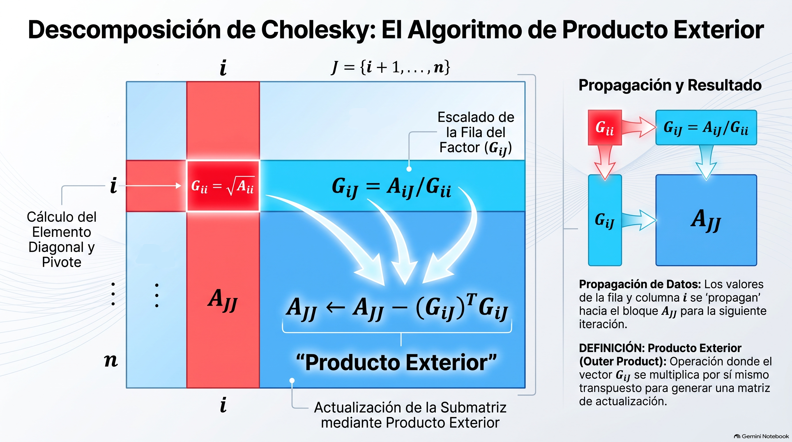
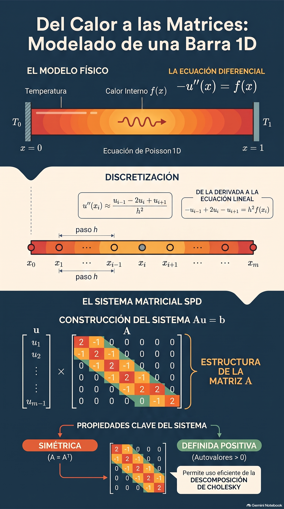

# Análisis Numérico II / Álgebra Lineal Numérica
## Clase 02: Descomposición de Cholesky

---

# Sistemas Definidos Positivos

**Definición:** Un sistema lineal $Ax=b$ con $A \in \mathbb{R}^{n \times n}$ es __simétrica definida positiva__ (SDP) si $A^T = A$ y $x^T A x \gt 0$ para todo $x \in \mathbb{R}^n$, $x \ne 0$.

**Nota:** Si reemplazamos $\gt$ por $\ge$ se obtiene la definición de matriz __simétrica semidefinida positiva__.

Alguna idea de un sistema SDP fácil de ver?

---

**Teorema:** Si $A$ es SDP, entonces todos sus autovalores son positivos y por lo tanto $A$ es invertible.

**Demostración:** Sea $v \ne 0$ autovector de $A$ con autovalor $\lambda$. Entonces $Av = \lambda v$. Multiplicando por la izquierda por $v^T$ se tiene $v^T A v = \lambda v^T v$. Como $A$ es SDP, $v^T A v > 0$, y como $v \ne 0$, $v^T v > 0$. Por lo tanto $\lambda > 0$.

---

# **Proposición:** Si $A \in \mathbb{R}^{n \times n}$ es SDP entonces:
i. $a_{ii} > 0$ para todo $i=1,\dots,n$.
ii. Las submatrices principales $A_k = \begin{bmatrix} a_{11} & \dots & a_{1k} \\ \vdots & \ddots & \vdots \\ a_{k1} & \dots & a_{kk} \end{bmatrix}$ son SDP para $k=1,\dots,n$.
iii. Si $X \in \mathbb{R}^{n \times m}$ con $rank(X)=m$, entonces $X^T A X$ es SDP.

**PIZARRÓN**

---

# **Demostración:**
i. Tomo $e^i$ vector canónico de $\mathbb{R}^n$ ($e^i = \begin{bmatrix} 0, \dots, 0, 1, 0, \dots, 0 \end{bmatrix}^T$, con $1$ en la posición $i$)

$A e^i = \begin{bmatrix} a^1 \dots a^n \end{bmatrix} \begin{bmatrix} 0 \\ . \\ 1 \\ . \\ 0 \end{bmatrix} = 0 a^1 + 0 a^2 + \dots + 1 a^i + \dots + 0 a^n = a^i$.

Entonces, $(e^i)^T A e^i = (e^i)^T a^i = a_{ii} > 0$ para todo $i=1,\dots,n$.

---

# **Demostración:**

ii. Sea $E_k = \begin{bmatrix} e^1 & \dots & e^k \end{bmatrix} = \begin{bmatrix} I_{k \times k} \\ 0_{(n-k) \times k} \end{bmatrix}$. 
Entonces, si $\mathcal{I} = \{1,\dots,k\}$ y $\mathcal{J} = \{k+1,\dots,n\}$,

$A_k = E_k^T A E_k = \begin{bmatrix} I_{k \times k} & 0_{k \times (n-k)} \end{bmatrix} \begin{bmatrix} A_{\mathcal{I}\mathcal{I}} & A_{\mathcal{I}\mathcal{J}} \\ A_{\mathcal{J}\mathcal{I}} & A_{\mathcal{J}\mathcal{J}} \end{bmatrix} \begin{bmatrix} I_{k \times k} \\ 0_{(n-k) \times k} \end{bmatrix} = A_{\mathcal{I}\mathcal{I}}$.

Ahora, si $y \in \mathbb{R}^k$, $y \ne 0$, entonces $x = E_k y \ne 0$ y $x^T A x = y^T E_k^T A E_k y = y^T A_k y > 0$, con lo que $A_k$ es SDP.

iii. se hace en el Práctico :D

---
# **Datos Útiles de Álgebra III**

Hay un par de cosas super importantes que no vamos a demostrar y asumimos sabidas.

1. Todos los autovalores de una matriz simétrica real son reales.
2. Una matriz simétrica es ORTOGONALMENTE DIAGONALIZABLE, ie. existe $Q \in \mathbb{R}^{n \times n}$ matriz ortogonal (columnas ortogonales entre sí) tal que $Q^T A Q = D$ es diagonal con los autovalores de $A$.

---
# Descomposición de Cholesky

- Supongamos que queremos resolver $Ax = b$ con $A \in \mathbb{R}^{n \times n}$ que es **simétrica** y **definida positiva**.
- Buscaremos una matriz $G \in \mathbb{R}^{n \times n}$ **triangular superior** tal que se cumpla la igualdad $A = G^T G$.
- Si pudiera obtener $G$, entonces $Ax = G^T G x = b$.
- Resolvamos en dos pasos: primero resolvemos $G^T y = b$ y luego $Gx = y$. Como $G$ es triangular superior, ambos sistemas son fáciles de resolver (por sustitución!).
- Existe esta descomposición? **SI!** y es **ÚNICA** (bajo una condición)!

---

# **Teorema** (Existencia y Unicidad de Cholesky)

Sea $A \in \mathbb{R}^{n \times n}$ simétrica y definida positiva.

Entonces existe una **única** matriz $G \in \mathbb{R}^{n \times n}$ triangular superior con elementos diagonales positivos tal que $A = G^T G$.

**PIZARRÓN**
Demostración en [Notas ALN Damián Fernandez (Teorema 2.7)](https://drive.google.com/file/d/10h9BvK-P0b4l9-1D7G2T4Q1R9sX6u5M9/view?usp=sharing)

**Corolario:** $A$ es SDP si y sólo si existe $G \in \mathbb{R}^{n \times n}$ triangular superior con elementos diagonales positivos tal que $A = G^T G$.

**Otro Corolario:** Si $A$ es SDP, entonces A es invertible. Cómo lo demostrarían?

---

# Algoritmo de Cholesky (idea)

Si estamos en un paso $i < n$, definimos $\mathcal{J} = \{i+1,\dots,n\}$ y veamos el bloque desde $a_{ii}$ en adelante:

$$\begin{bmatrix} a_{ii} & A_{i\mathcal{J}} \\ A_{\mathcal{J}i} & A_{\mathcal{J}\mathcal{J}} \end{bmatrix} = \begin{bmatrix} g_{ii} & 0 \\ G_{\mathcal{J}i}^T & G_{\mathcal{J}\mathcal{J}}^T \end{bmatrix} \begin{bmatrix} g_{ii} & G_{i\mathcal{J}} \\ 0 & G_{\mathcal{J}\mathcal{J}} \end{bmatrix}$$

Luego:
- $a_{ii} = g_{ii}^2$ y por lo tanto $g_{ii} = \sqrt{a_{ii}}$.
- $A_{i\mathcal{J}} = g_{ii} G_{i\mathcal{J}}$ y por lo tanto $G_{i\mathcal{J}} = \frac{1}{g_{ii}} A_{i\mathcal{J}}$.
- Tenemos además $A_{\mathcal{J}\mathcal{J}} = G_{\mathcal{J}i}^T G_{i\mathcal{J}} + G_{\mathcal{J}\mathcal{J}}^T G_{\mathcal{J}\mathcal{J}}$, entonces debemos actualizar

$$A_{\mathcal{J}\mathcal{J}} \leftarrow A_{\mathcal{J}\mathcal{J}} - G_{\mathcal{J}i}^T G_{i\mathcal{J}}$$

- Repetir hasta terminar!

---

---

# Algoritmo **(Descomposición de Cholesky Prod Ext)**
**Entrada:** Matriz "SDP" $A \in \mathbb{R}^{n \times n}$.
**Salida:** Matriz triangular superior $G \in \mathbb{R}^{n \times n}$ tal que $A = G^T G$.

Para $i=1,\dots,n$ definir:

1. $g_{ii} = \sqrt{a_{ii}}$
2. Si $i < n$ entonces
    - $\mathcal{J} = \{ i+1, \dots, n \}$
    - $g_{i\mathcal{J}} = A_{i\mathcal{J}} / g_{ii}$
    - $A_{\mathcal{J}\mathcal{J}} \leftarrow A_{\mathcal{J}\mathcal{J}} - G_{i\mathcal{J}}^T G_{i\mathcal{J}}$
3. Retornar $G$.

*¿Este algoritmo se puede romper? ¿Cómo?*

---

# Algoritmo **(Descomposición de Cholesky Prod Int)**
**Entrada:** Matriz "SDP" $A \in \mathbb{R}^{n \times n}$.
**Salida:** Matriz triangular superior $G \in \mathbb{R}^{n \times n}$ tal que $A = G^T G$.

1. Definir $\mathcal{J} = \{1,\dots,n\}$,
$$ G_{1\mathcal{J}} = \frac{1}{\sqrt{a_{11}}} A_{1\mathcal{J}} $$

2. Para $i=2,\dots,n$ definir $\mathcal{I} = \{1,\dots,i-1\}$ y $\mathcal{J} = \{i,\dots,n\}$.
$$ G_{i\mathcal{J}} = A_{i\mathcal{J}} - G_{\mathcal{I}i}^T G_{\mathcal{I}\mathcal{J}} $$
$$ G_{i\mathcal{J}} \leftarrow G_{i\mathcal{J}} / \sqrt{g_{ii}} $$

3. Retornar $G$.

*Si un día están al pedo, pueden intentar deducirlo... :D*

---

# Algoritmo **(Descomposición de Cholesky)**
## Conteo Operacional

Siguiendo la lógica de la implementación por filas y columnas:

- **Actualización de la diagonal ($G_{ii}$):** Requiere un producto interno de vectores de longitud $i-1$, una resta y una raíz cuadrada. El costo acumulado es de aproximadamente **$n^2$ flops**
- **Actualización fuera de la diagonal ($G_{iJ}$):** Es la parte más costosa debido a un bucle triplemente anidado que realiza productos y sumas para cada elemento. Este bloque suma aproximadamente **$n^3/3$ flops**

---

# Conteo Total y Complejidad

El número exacto de operaciones para el algoritmo de producto interior es:
$$Costo = \frac{n^3}{3} + \frac{n^2}{2} + \frac{7n}{6}$$

**Resultados Clave:**
- La complejidad computacional dominante es **$O(n^3/3)$**.
- Las divisiones ($n^2/2$) y las raíces cuadradas ($n$) tienen un impacto insignificante en matrices de gran porte.

---

# Algoritmo **(Resolución de Sistema Lineal SDP)**
**Entrada:** Sistema Lineal SDP $A \in \mathbb{R}^{n \times n}$ y vector $b \in \mathbb{R}^n$.
**Salida:** Vector solución $x \in \mathbb{R}^n$.

1. Calcular la descomposición Cholesky de $A$: $A = G^T G$.
2. Resolver el sistema triangular inferior $G^T y = b$ para $y$ (sustitución hacia adelante).
3. Resolver el sistema triangular superior $Gx = y$ para $x$ (sustitución hacia atrás).
4. Retornar $x$.

---

# Un poco de Historia...

- Cholesky (1875–1918) era oficial de artillería e ingeniero geodesta del Service Géodésique de l'Armée Français.
- Propuesto en 1910 para resolver sistemas lineales provenientes de métodos de mínimos cuadrados en topografía.
- Cholesky no alcanzó a publicar su método, murió en la Primera Guerra Mundial :'((
- Ernest Benoit, compañero de Cholesky, lo publicó en 1924.

---

# Aplicación y Costo Computacional

- La principal aplicación es resolver sistemas lineales $Ax = b$ descomponiendo el problema en dos sistemas triangulares: $G^T y = b$ y $Gx = y$.
- Este método es fundamental en ingeniería y física, por ejemplo, para modelar la **distribución de temperatura** en una placa de acero.
- El costo operacional de la descomposición de Cholesky es de aproximadamente **$O(n^3/3)$ flops**.
- En términos de eficiencia, este algoritmo requiere aproximadamente la **mitad de operaciones** que una eliminación gaussiana.

