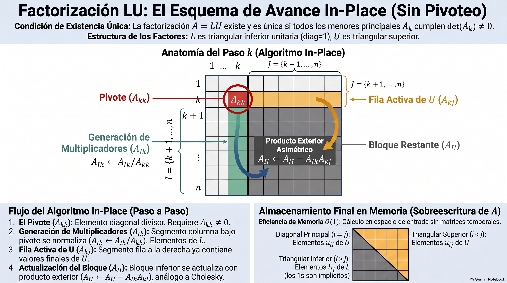

# Análisis Numérico II / Álgebra Lineal Numérica
## Clase 04: Descomposición LU Tradicional y con Pivoteo

---

# Descomposición LU

Tenemos un conjunto de Transformaciones de Gauss que aplicamos a izquierda para obtener una matriz triangular superior $U$.

$$ U = M_{n-1} \dots M_1 A $$

Entonces, si $M_k = I - v_k e_k^T$ con $v_k$ vector de multiplicadores:

$$ A = (M_{n-1} \dots M_1)^{-1} U = M_1^{-1} \dots M_{n-1}^{-1} U $$

Definimos $L = M_1^{-1} \dots M_{n-1}^{-1}$ y cada $M_k^{-1}$ es de la forma $I + v_k e_k^T$

---

# Teorema **(Existencia y Unicidad de la Descomposición LU)**

Sea $A \in \mathbb{R}^{n \times n}$. Si $det(A_k) \neq 0$ para toda submatriz principal de tamaño $k \in \{1, \dots, n\}$, entonces existe una factorización única de $A$ de la forma

$$ A = L U $$

donde $L \in \mathbb{R}^{n \times n}$ es una matriz triangular inferior con $L_{ii} = 1$ para todo $i \in \{1, \dots, n\}$, y $U \in \mathbb{R}^{n \times n}$ es una matriz triangular superior.

---

# Demostración de Existencia: Estrategia

Procedemos por **inducción** sobre el paso $k$ de la Eliminación Gaussiana. Queremos demostrar que los pivotes $a_{kk}^{(k-1)}$ nunca se anulan.

- **Caso Base ($k=1$):**
  La submatriz principal de orden 1 es $A_1 = [a_{11}]$. Como $\det(A_1) \neq 0$, se deduce que el primer pivote **$a_{11} \neq 0$**. Esto garantiza que la primera transformación de Gauss $M_1$ está bien definida.

- **Hipótesis Inductiva:**
  Suponemos que ha sido posible realizar con éxito los primeros $k-1$ pasos de la eliminación, transformando la matriz original en:
  $$A^{(k-1)} = M_{k-1} \dots M_1 A$$

---

# Paso Inductivo: Estructuración por Bloques

Debemos garantizar que el pivote de la etapa actual, $a_{kk}^{(k-1)}$, sea distinto de cero. 

Definamos la matriz acumulada de transformaciones de Gauss como:
$$\Gamma = M_{k-1} \dots M_1$$

Como cada $M_i$ es **triangular inferior unitaria**, el producto $\Gamma$ también posee esta estructura. Si particionamos la ecuación $A^{(k-1)} = \Gamma A$ analizando el bloque superior izquierdo de tamaño $k \times k$, obtenemos:

$$A^{(k-1)}_{1:k, 1:k} = \Gamma_{1:k, 1:k} A_k$$

---

# Paso Inductivo: El Rol de los Determinantes

Aplicando la propiedad del determinante al producto de bloques de tamaño $k \times k$:

$$\det(A^{(k-1)}_{1:k, 1:k}) = \det(\Gamma_{1:k, 1:k}) \cdot \det(A_k)$$

Dado que $\Gamma_{1:k, 1:k}$ es una matriz triangular inferior unitaria, su determinante es idénticamente **$1$**. Por lo tanto:

$$\det(A^{(k-1)}_{1:k, 1:k}) = \det(A_k)$$

Por hipótesis del teorema, sabemos que $\det(A_k) \neq 0$, lo que implica que el bloque $A^{(k-1)}_{1:k, 1:k}$ es **no singular**.

---

# Paso Inductivo: Conclusión de la Existencia

Como la submatriz $A^{(k-1)}_{1:k, 1:k}$ es triangular superior (debido a los $k-1$ pasos de eliminación ya completados), su determinante se calcula simplemente como el producto de sus elementos diagonales:

$$\det(A^{(k-1)}_{1:k, 1:k}) = a_{11}^{(0)} \cdot a_{22}^{(1)} \dots a_{kk}^{(k-1)}$$

Dado que este producto es distinto de cero ($\det(A_k) \neq 0$), **ninguno de sus factores puede ser nulo**.

Por lo tanto, **$a_{kk}^{(k-1)} \neq 0$**, el pivote está bien definido y el proceso de inducción queda completo. Al final, se obtiene $A = LU$.

---

# Demostración de Unicidad

Supongamos que existen dos factorizaciones distintas para la matriz $A$:
$$A = L_1 U_1 \quad \text{y} \quad A = L_2 U_2$$

Como $A$ es no singular, tanto $L_i$ como $U_i$ son invertibles. Igualando ambas expresiones:
$$L_1 U_1 = L_2 U_2 \implies L_2^{-1} L_1 = U_2 U_1^{-1}$$

- El lado izquierdo ($L_2^{-1} L_1$) es el producto de matrices triangulares inferiores unitarias, por lo que es **triangular inferior unitaria**.
- El lado derecho ($U_2 U_1^{-1}$) es el producto de matrices triangulares superiores, por lo que es **triangular superior**.

La única matriz que es simultáneamente triangular superior y triangular inferior unitaria es la **matriz identidad $I$**.

---

# Conclusión de la Unicidad

Por lo tanto, se debe cumplir la igualdad:

$$L_2^{-1} L_1 = I \implies L_1 = L_2$$

Y de igual manera:

$$U_2 U_1^{-1} = I \implies U_1 = U_2$$

Lo que demuestra que **la descomposición LU (cuando existe) es única**.

---

# Algoritmo **(Factorización LU)**
**Entrada:** Matriz $A \in \mathbb{R}^{n \times n}$.
**Salida:** Matrices $L \in \mathbb{R}^{n \times n}$ y $U \in \mathbb{R}^{n \times n}$ tales que $A = L U$.

1. Inicializar $L = I$ y $U = A$.
2. Para $k = 1 \dots n-1$, definir
    - $\mathcal{I} = \{ k+1, \dots, n \}$
    - $\mathcal{J} = \{ k, \dots, n \}$
    - $v_{\mathcal{I}} = U_{\mathcal{I},k} / u_{k,k}$
    - $L_{\mathcal{I},k} = v_{\mathcal{I}}$
    - $U_{\mathcal{I},\mathcal{J}} \leftarrow U_{\mathcal{I},\mathcal{J}} - v_{\mathcal{I}} U_{k,\mathcal{J}}$
3. Retornar $L$, $U$.

---

---

# Algoritmo **(Resolución de sistemas no singulares con LU)**

**Entrada:** Matriz $A \in \mathbb{R}^{n \times n}$ y vector $b \in \mathbb{R}^n$.
**Salida:** Vector $x \in \mathbb{R}^n$ solución del sistema $Ax = b$.

1. Obtener $L, U$ a partir de la factorización LU de $A$.
2. Resolver $Ly = b$ mediante sustitución hacia adelante.
3. Resolver $Ux = y$ mediante sustitución hacia atrás.
4. Retornar $x$.

---

# Todo muy lindo cuando el pivot no es nulo... PERO...

- Cualquier matriz pedorra (como $\begin{bmatrix}0&1\\1&0\end{bmatrix}$) ya nos causa problemas.
- No sólo un pivot cero nos complica, también nos complica un pivot muy chiquito:

$$
\begin{bmatrix} \epsilon & 1\\1&0\end{bmatrix} = \begin{bmatrix} 1& 0\\ 1/\epsilon & 1\end{bmatrix} \begin{bmatrix} \epsilon & 1\\0& -1/\epsilon\end{bmatrix}
$$

es un producto de dos matrices que combinan valores muy grandes y muy chicos.

_Veamos un ejemplo parecido en código_

---

# Eliminación con Pivoteo Parcial

Para evitar problemas con pivots nulos o muy pequeños, en cada paso $k$ vamos a:

1. **Buscar el pivote más grande en valor absoluto:** Antes de realizar la eliminación para la columna $k$, encontrar la entrada en esa columna con el mayor valor absoluto, en o por debajo de la diagonal. Sea esta $a_{ik}$, donde $i \ge k$.

2. **Intercambiar filas:** Intercambiar la fila $i$ con la fila del pivote actual, la fila $k$.

3. **Eliminar:** Proceder con la eliminación como de costumbre, utilizando ahora el mayor pivote posible para esa columna.

---

# Definición (Matriz de Permutación)

- Una matriz de permutación es aquella que se obtiene de la matriz identidad mediante un número finito de intercambios de filas o columnas.

- Ejemplo: Premultiplicar (multiplicar a izquierda) una matriz $A$ por $P = \begin{bmatrix} 0& 1& 0 \\ 1& 0& 0 \\ 0& 0& 1\end{bmatrix}$ intercambia la 1ra y 2da fila de $A$.

- Ejemplo: Postmultiplicar (multiplicar a derecha) una matriz $A$ por la misma $P$ intercambia la 1ra y 2da columna de $A$.

- Para lo que sigue solamente nos interesa premultiplicar.

---

# Algoritmo (Eliminación Gaussiana + Pivoteo Parcial)
**Entradas:** Matriz $A \in \mathbb{R}^{n \times n}$ y vector $b \in \mathbb{R}^n$.
**Salidas:** $U \in \mathbb{R}^{n \times n}$, $y \in \mathbb{R}^n$ sistema equivalente.

1. Para $k = 1 \dots n-1$:
    - tomar $l$ t.q. $|A_{l,k}| = \max_{j \in \{k,\dots,n\}} |A_{j,k}|$.
      - si $l \neq k$: intercambiar filas $l$ y $k$ en $A$ y $b$.
    - $\mathcal{I} = \{ k+1, \dots, n \}$
    - $v_{\mathcal{I}} = A_{\mathcal{I},k} / a_{k,k}$ y $A_{\mathcal{I},k} = 0$
    - $A_{\mathcal{I},\mathcal{I}} \leftarrow A_{\mathcal{I},\mathcal{I}} - v_{\mathcal{I}} A_{k,\mathcal{I}}$
    - $b_{\mathcal{I}} \leftarrow b_{\mathcal{I}} - v_{\mathcal{I}} b_k$
2. Retornar $U=A$, $y=b$.

_Resolver el sistema queda como tarea..._

---

# Descomposición LU con Permutaciones

Ahora, cada transformación de Gauss que hagamos estará acompañada de un intercambio de filas previo:

$$M_{n-1} P_{n-1} \dots M_1 P_1 A = U$$

Lo que se puede demostrar es que existe una matriz de permutación de filas $P$ tal que

$$P A = L U$$

La formalización de tal afirmación es la siguiente:

---

# Teorema (Descomposición LU con Permutaciones)

Sea $A \in \mathbb{R}^{n \times n}$ y $U = M_{n-1} P_{n-1} \dots M_1 P_1 A$ con $P_i$ y $M_i$ obtenidos por eliminación con pivoteo parcial. Entonces,

$$P A = L U$$

donde $P = P_{n-1} \dots P_1$ es una matriz de permutación de filas y
$$L = I + \sum_{k=1}^{n-1} g^k (e^k)^T$$
con $g^k = P_{n-1}\dots P_{k+1} v^k$.

---

## Demostración:

Para construir la relación $PA = LU$, reordenamos las operaciones intercalando identidades usando $P_k^2 = I$:
$$U = M_{n-1} P_{n-1} \dots M_2 P_2 M_1 P_1 A$$
$$U = M_{n-1} P_{n-1} \dots M_2 (P_3\dots P_{n-1})(P_{n-1}\dots P_3) P_2 M_1 P_2 (P_2\dots P_{n-1})(P_{n-1}\dots P_2) P_1 A$$

Agrupando, definimos:
$$P = P_{n-1} \dots P_1$$
$$\tilde{M}_k = P_{n-1} \dots P_{k+1} M_k P_{k+1} \dots P_{n-1} \quad \text{para } k = 1, \dots, n-2$$
$$\tilde{M}_{n-1} = M_{n-1}$$

Esto nos permite rescribir de forma simplificada la reducción de la matriz original como:
$$\tilde{M}_{n-1} \dots \tilde{M}_1 P A = U$$

---

## Demostración:

Si $i \ge k+1$, entonces $P_i$ solo intercambia filas $i$ y $l$ (con $l \ge i$). Por lo tanto:
$$(e^k)^T P_i = (e^k)^T \quad \text{si } k \ge i$$

Luego, como las transformaciones de Gauss son de la forma $M_k = I - v_k(e_k)^T$:
$$\tilde{M}_k = P_{n-1} \dots P_{k+1} (I - v_k(e_k)^T) P_{k+1} \dots P_{n-1} = I - g_k(e_k)^T$$

Donde $g_k = P_{n-1} \dots P_{k+1} v_k$ sigue teniendo ceros en sus primeras $k$ componentes. Recordando que $\tilde{M}_k^{-1} = I + g_k(e_k)^T$, entonces:
$$L = \tilde{M}_1^{-1} \dots \tilde{M}_{n-1}^{-1} = I + \sum_{k=1}^{n-1} g_k(e_k)^T$$
Luego $PA = LU$, donde $L$ es triangular inferior unitaria. $\blacksquare$

---

# Algoritmo (Descomposición LU con Permutaciones)

**Entrada:** Matriz $A \in \mathbb{R}^{n \times n}$.
**Salidas:** $L, U, $P \in \mathbb{R}^{n \times n}$ (tr. inf., tr.sup. y permutación) tal que $PA = LU$.

1. Inicializar $P = I$.
2. Para $k = 1 \dots n-1$, tomar $l$ tq $|A_{l,k}| = \max_{j \in \{k, \dots, n\}} \{|A_{j,k}|\}$.
    - Si $l \neq k$: intercambiar filas $l$ y $k$, hacer:
      - $A \leftarrow P_{l,k} A$, con $P_{l,k}$ matriz que intercambia filas $l$ y $k$.
      - $P \leftarrow P_{l,k} P$
    - $\mathcal{I} = \{ k+1, \dots, n \}$
    - $A_{\mathcal{I}k} \leftarrow A_{\mathcal{I}k}/a_{kk}$
    - $A_{\mathcal{I}\mathcal{I}} \leftarrow A_{\mathcal{I}\mathcal{I}} - A_{\mathcal{I}k} A_{k\mathcal{I}}$
3. Retornar $A$ y $P$.

---

# Conteo Operacional y Cálculo de Inversa

- Hay que hacerlo? Por qué me lo vengo olvidando en todos los algoritmos anteriores?
- Para calcular la inversa de una matriz $A$ se puede usar la descomposición LU 
  - Debo encontrar una matriz $X$ tal que $AX = I$, pero
  $$
  AX = \begin{bmatrix} Ax^1 & Ax^2 & \dots & Ax^n \end{bmatrix} = \begin{bmatrix} e^1 & e^2 & \dots & e^n \end{bmatrix}
  $$
  donde $x^i$ y $e^i$ son las columnas de $X$ e $I$ respectivamente.
  - Entonces puedo descomponer $A = LU$ y resolver $n$ sistemas lineales de la forma $LUx^i = e^i$ para $i = 1, \dots, n$.
  - Cuántas operaciones hago acá?
