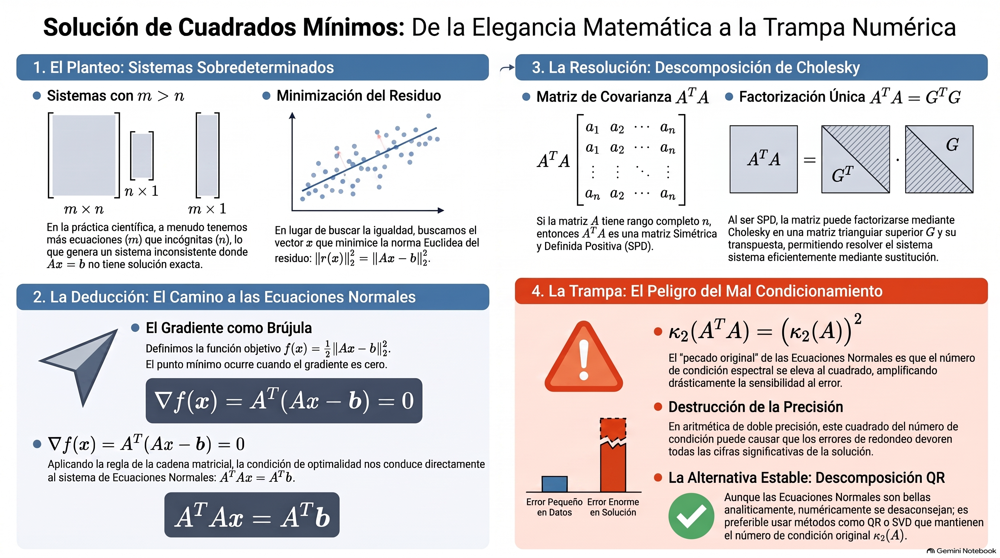
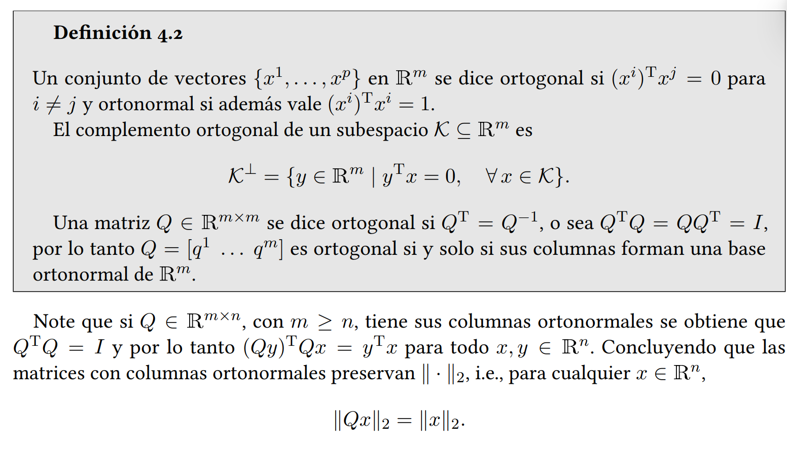
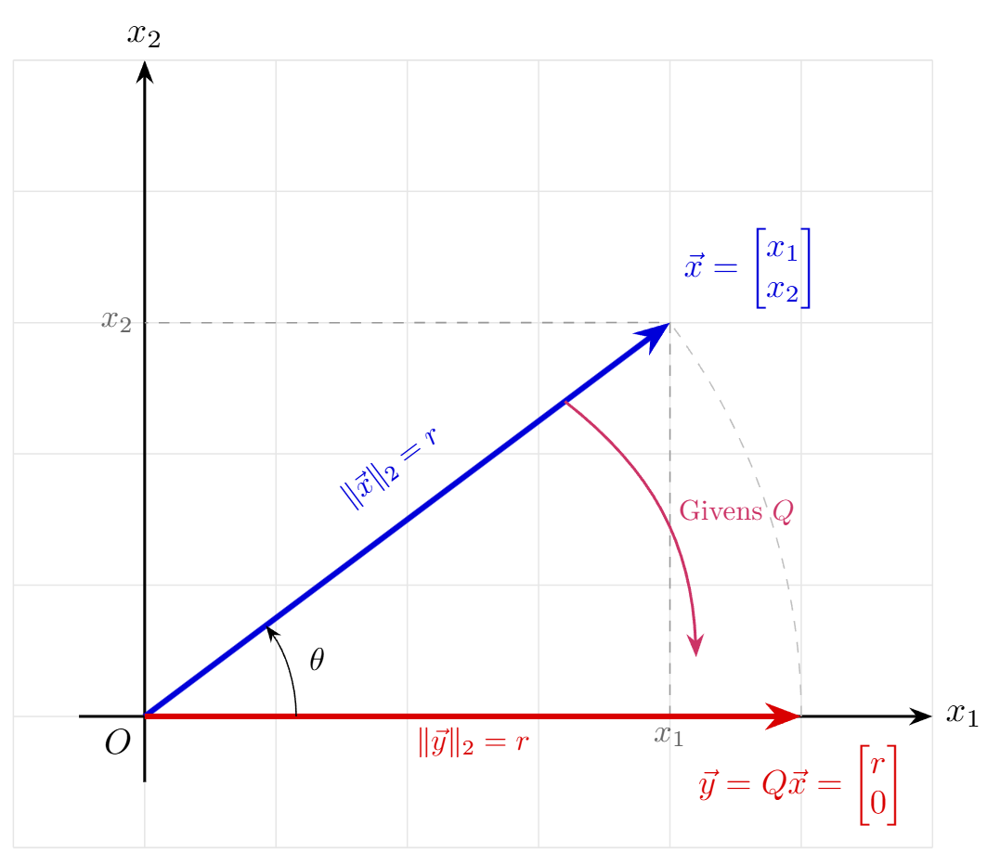

# Análisis Numérico II / Álgebra Lineal Numérica
## Clase 07: Descomposición QR

---

---

---

# Descomposición QR

Supongamos que queremos resolver el sistema lineal $Ax=b$ y que $A$ es una matriz de tamaño $m \times n$ con $m \geq n$. Si multiplicamos el residuo por una matriz ortogonal $Q$, obtenemos:

$$
\|Ax-b\|_2 = \|Q^T(Ax-b)\|_2 = \|Q^TAx-Q^Tb\|_2
$$

Aplicaremos transformaciones ortogonales a la matriz $A$ hasta hacerla triangular superior, de la misma forma que hicimos con Eliminación Gaussiana.

Veremos 2 maneras de hacerlo: **Rotaciones de Givens** y **Transformaciones de Householder**.

---

# Rotaciones de Givens

Las **Rotaciones de Givens** son transformaciones lineales ortogonales diseñadas para anular de forma precisa y selectiva un elemento individual de un vector o matriz.

Sea $x = \begin{bmatrix} x_1 \\ x_2 \end{bmatrix}$. Buscamos rotar por un ángulo $\theta$ que anule la segunda coordenada:

$$y = \begin{bmatrix} r \\ 0 \end{bmatrix} = G \begin{bmatrix} x_1 \\ x_2 \end{bmatrix} = \begin{bmatrix} \cos(\theta) & -\sin(\theta) \\ \sin(\theta) & \cos(\theta) \end{bmatrix} \begin{bmatrix} x_1 \\ x_2 \end{bmatrix}$$

Al desarrollar el producto, la condición para anular el segundo componente es:
$$s \cdot x_1 + c \cdot x_2 = 0 \quad (\text{donde } c = \cos(\theta), \ s = \sin(\theta))$$

---

Sabiendo que $c^2 + s^2 = 1$, se resuelven los coeficientes trigonométricos como:
$$c = \frac{x_1}{\sqrt{x_1^2 + x_2^2}}, \quad s = \frac{-x_2}{\sqrt{x_1^2 + x_2^2}}$$

Esto produce una primera componente transformada: $r = c \cdot x_1 - s \cdot x_2 = \|x\|_2$

---

# Generalización a $\mathbb{R}^m$

Para anular un elemento $x_k \in \mathbb{R}$ utilizando el pivote $x_i \in \mathbb{R}$ dentro de un vector de dimensión $m$, embebemos la rotación en la matriz identidad $G_{ki} \in \mathbb{R}^{m \times m}$:

$$
G_{ki} = \begin{bmatrix}
I & & & & \\
& c & \dots & -s & \\
& \vdots & I & \vdots & \\
& s & \dots & c & \\
& & & & I
\end{bmatrix} \begin{matrix} \\ \leftarrow \text{fila } i \\ \\ \leftarrow \text{fila } k \\ \end{matrix}$$

Cómo actúa esta transformación sobre todo el vector $x$?

---

# Ejemplo

Consideremos el vector $x = \begin{bmatrix} 3 & 4 & 12 \end{bmatrix}^T \in \mathbb{R}^3$. Queremos anular la tercera componente ($x_3 = 12$) usando como pivote la primera ($x_1 = 3$).

- **Coordenadas activas:** $i = 1$ (fila pivote) y $k = 3$ (fila a anular).
- **Cálculo de coeficientes $c$ y $s$**:
  $$c = \frac{3}{\sqrt{3^2 + 12^2}} = \frac{3}{\sqrt{153}}, \quad s = \frac{-12}{\sqrt{3^2 + 12^2}} = \frac{-12}{\sqrt{153}}$$

---

La matriz de rotación de Givens $G_{31}$ se construye como:
$$G_{31} = \begin{bmatrix} c & 0 & -s \\ 0 & 1 & 0 \\ s & 0 & c \end{bmatrix}$$

Al multiplicar el vector $x$ por nuestra matriz de rotación $G_{31}$ obtenemos:

$$y = G_{31} x = \begin{bmatrix} c & 0 & -s \\ 0 & 1 & 0 \\ s & 0 & c \end{bmatrix} \begin{bmatrix} x_1 \\ x_2 \\ x_3 \end{bmatrix} = \begin{bmatrix} c x_1 - s x_3 \\ x_2 \\ s x_1 + c x_3 \end{bmatrix} = \begin{bmatrix} \sqrt{x_1^2 + x_3^2} \\ x_2 \\ 0 \end{bmatrix} = \begin{bmatrix} \sqrt{153} \\ 4 \\ 0 \end{bmatrix}$$

**RECORDAR:** En la práctica nunca vamos a construir la matriz de rotación explícitamente.

---

# Estabilidad Numérica

El cálculo de $r = \sqrt{a^2+b^2}$ puede causar *overflow* si $a$ o $b$ son muy grandes, o *underflow* y pérdida de precisión si son muy pequeños. Existe algo más robusto:

Si $|a| \ge |b|$:
1. Si $b=0$, entonces $c=1, s=0$ y $r=a$.
2. Si $b \ne 0$, se calcula $t = b/a$. Como $|a| \ge |b|$, entonces $|t| \le 1$.
3. Se calcula $r = |a| \sqrt{1+t^2}$. Esto evita elevar al cuadrado números muy grandes o muy pequeños.
4. Luego, $c = \frac{a}{r} = \frac{a}{|a|\sqrt{1+t^2}} = \frac{\text{sign}(a)}{\sqrt{1+t^2}}$ y $s = \frac{b}{r} = \frac{at}{|a|\sqrt{1+t^2}} = \frac{t \cdot \text{sign}(a)}{\sqrt{1+t^2}}$.

Si $|b| > |a|$ se hace un cálculo similar, pero con $t = a/b$. 

---

# Algoritmo **(Rotación de Givens)**

**Entradas:** $x_1, x_2 \in \mathbb{R}$. **Salidas:** $c, s \in \mathbb{R}$

- Si $|x_1| + |x_2| = 0$, **retornar** $c = 1, s = 0$
- Si $|x_2| \gt |x_1|$:
    $$t = -x_1/x_2$$
    $$s = -\text{sign}(x_2) / \sqrt{1+t^2}, \ c = t \cdot s$$
- Sino:
    $$t = -x_2/x_1$$
    $$c = \text{sign}(x_1) / \sqrt{1+t^2}, \ s = t \cdot c$$
- **Retornar** $c$ y $s$.

---

# Anulando Elementos

Para obtener la descomposición $A = QR$ de una matriz $A \in \mathbb{R}^{m \times n}$, aplicamos transformaciones ortogonales en el lado izquierdo de $A$ de manera secuencial para introducir ceros por debajo de la diagonal principal, trabajando columna por columna.

- Para la columna _activa_ $j$ (desde $1$ hasta $p = \min\{m-1, n\}$), eliminamos cada elemento $a_{kj}$ situado debajo de la diagonal (es decir, para $k = j+1, \dots, m$).
- Cada elemento $a_{kj}$ se anula utilizando el elemento diagonal $a_{jj}$ como pivote. Esto se logra multiplicando a la izquierda por la matriz de rotación embebida $G_{kj}$:

$$A \leftarrow G_{kj} A$$

---

# La Secuencia Global de Rotaciones

Reducimos la matriz de izquierda a derecha buscando la matriz triangular superior $R$:

- **Para la primera columna ($j=1$):**
  $$A^{(1)} = G_{m1} \dots G_{31} G_{21} A \quad (\text{m-1 rotaciones})$$
- **Secuencia completa hasta la última columna ($j=n$, si $m > n$):**
  $$R = (G_{m,n} \dots G_{n+1,n}) \dots (G_{m2} \dots G_{32}) (G_{m1} \dots G_{21}) A = Q^T A$$

Como $G^T = G^{-1}$, entonces $Q \in \mathbb{R}^{m \times m}$ se reconstruye como:
$$Q = G_{21}^T G_{31}^T \dots G_{m1}^T G_{32}^T \dots G_{m, m-1}^T$$

---

# Impacto en las Filas de la Matriz

Cuando se aplica el operador $G_{kj}$ a la izquierda de la matriz $A$, las propiedades de la transformación aseguran un comportamiento local óptimo.

1. Los elementos de las columnas $1, \dots, j-1$ que ya habían sido anulados permanecen en cero ($0$) porque la rotación actúa sobre componentes nulos.
2. Solo las filas $j$ (pivote) y $k$ (elemento a anular) sufren modificaciones en el rango de columnas restantes $J = \{j, \dots, n\}$:

$$\begin{bmatrix} A_{j, J} \\ A_{k, J} \end{bmatrix} \leftarrow \begin{bmatrix} c & -s \\ s & c \end{bmatrix} \begin{bmatrix} A_{j, J} \\ A_{k, J} \end{bmatrix}$$

---

# Algoritmo **(Desc. QR por Rotaciones de Givens)**

**Entradas:** $A \in \mathbb{R}^{m \times n}$. **Salidas:** $Q \in \mathbb{R}^{m \times m}$, $R \in \mathbb{R}^{m \times n}$

- **Inicializar:** $Q = I_{m \times m}$
- **Para** $j = 1 \dots p = \min\{m-1, n\}$: **para** $i = j+1 \dots m$:
    - Si $a_{i,j} \neq 0$, definir $\mathcal{I} = \{j, i\}$ y $\mathcal{J} = \{j, \dots, n\}$:
        **Calcular:** $G = \begin{bmatrix} c & -s \\ s & c \end{bmatrix}$, $c, s = rotacion\_givens(a_{j,j}, a_{i,j})$
        $$ A_{\mathcal{I}, \mathcal{J}} \leftarrow G A_{\mathcal{I}, \mathcal{J}} $$
        $$ Q_{*, \mathcal{I}} \leftarrow Q_{*, \mathcal{I}} G^T $$
- Si $m \le n$ y $a_{mm} = 0$, definir $\mathcal{J} = \{m, \dots, n\}$ y 
$$ A_{m, \mathcal{J}} \leftarrow -A_{m, \mathcal{J}}, \quad Q_{*, m} \leftarrow -Q_{*, m} $$
- **Retornar** $Q$ y $R=A$

---

# Conteo Operacional

Para realizar una factorización QR en una matriz $m \times n$, debemos anular todos los elementos por debajo de la diagonal principal:

- Aplicar una rotación de Givens a una matriz $m \times n$ (es decir, actualizar dos filas de longitud $n$) cuesta aproximadamente $6n$ *flops*.
- Para triangularizar la matriz, necesitamos eliminar aproximadamente $\frac{1}{2} n(2m-n-1)$ elementos (para $m \ge n$).
- Costo total (generar $R$): $\approx 3mn^2 - n^3$ *flops*. Para una matriz $n \times n$: $\approx 2n^3$ *flops*.

---

# Aplicación en Mínimos Cuadrados

Una vez que la matriz $A$ se ha reducido a una forma triangular superior $R$ mediante rotaciones de Givens, el sistema de mínimos cuadrados $Ax \approx b$ se transforma de manera equivalente en:

$$Q^T A x \approx Q^T b \quad \implies \quad R x \approx b'$$

Donde $b' = Q^T b$. El nuevo sistema matricial $Rx \approx b'$ mantiene la misma estructura de dimensiones $m \times n$ pero con la particularidad de que $R$ posee ceros por debajo de la diagonal principal.

---

La estructura de matriz triangular superior de $R$ permite aislar las ecuaciones correspondientes a las filas no nulas. Específicamente, si $r$ denota el rango efectivo de $A$ (el número de filas no nulas en $R$, con $r \leq \min\{m, n\}$), las últimas $m-r$ ecuaciones del sistema son triviales (equivalentes a $0 \approx 0$).

Por lo tanto, el problema se reduce a resolver el sistema cuadrado $R_{r \times r} x = b'_{r}$, donde $R_{r \times r}$ es la submatriz triangular superior de orden $r$ obtenida extrayendo las primeras $r$ filas de $R$, y $b'_r$ es el vector de tamaño $r$ correspondiente a las primeras $r$ componentes de $b'$.

---

Finalmente, la solución del sistema triangular $R_{r \times r} x = b'_r$ se obtiene mediante sustitución regresiva. Para cada fila $i$ desde $r$ hasta $1$, se despeja la componente diagonal $x_i$ utilizando los valores ya calculados para $x_{i+1}, \dots, x_r$:

$$x_i = \frac{1}{R_{i,i}} \left( b'_i - \sum_{j=i+1}^r R_{i,j} x_j \right)$$

Este proceso genera la solución de mínimos cuadrados $x$ para el sistema original $Ax \approx b$.
