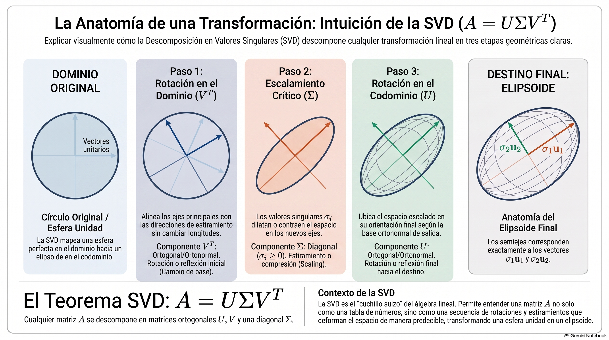

# Análisis Numérico II / Álgebra Lineal Numérica
## Clase 09: Descomposición SVD

---

# Los 4 Subespacios Fundamentales

Toda matriz $A \in \mathbb{R}^{m \times n}$ define una transformación lineal entre dos espacios vectoriales fundamentales: el **dominio de entrada** $\mathbb{R}^n$ y el **codominio de salida** $\mathbb{R}^m$.

---

# 1. El Espacio Columna (Rango-Imagen): $R(A)$

Es el conjunto de todos los vectores de salida posibles que pueden generarse mediante la transformación lineal de un vector de entrada.

- **Definición Formal:**
  $$R(A) = \{y \in \mathbb{R}^m \mid \exists x \in \mathbb{R}^n: y = Ax\}$$
- **Geometría:** Es el **generado (span) de las columnas** de $A$. Es un subespacio del espacio de salida $\mathbb{R}^m$.
- **Dimensión:** Su dimensión se define como el **rango ($r$)** de la matriz, que representa el número de columnas linealmente independientes.

---

# 2. El Espacio Nulo (Núcleo): $N(A)$

Es el conjunto de todos los vectores del dominio de entrada que son proyectados exactamente hacia el vector nulo mediante la transformación lineal.

- **Definición Formal:**
  $$N(A) = \{x \in \mathbb{R}^n \mid Ax = 0\}$$
- **Geometría:** Es un subespacio del espacio de entrada $\mathbb{R}^n$. 
- **Significado Numérico:** Si el espacio nulo contiene elementos más allá del vector cero ($0$), la transformación deja de ser inyectiva.
- **Dimensión:** Su dimensión se conoce como **nulidad ($n - r$)**.

---

# 3. El Espacio Fila: $R(A^T)$

Es el conjunto de todas las combinaciones lineales posibles formadas a partir de los vectores fila de la matriz $A$.

- **Definición Formal:** Es equivalente al espacio columna de la matriz transpuesta:
  $$R(A^T) = \{x \in \mathbb{R}^n \mid \exists y \in \mathbb{R}^m: x = A^T y\}$$
- **Geometría:** Es un subespacio del espacio de entrada $\mathbb{R}^n$.
- **Igualdad Fundamental:** La dimensión del espacio fila es exactamente igual al **rango ($r$)** de la matriz. Toda matriz posee el mismo número de filas linealmente independientes que de columnas linealmente independientes.

---

# 4. El Espacio Nulo Izquierdo: $N(A^T)$

Es el espacio nulo asociado a la matriz transpuesta de la transformación lineal.

- **Definición Formal:**
  $$N(A^T) = \{y \in \mathbb{R}^m \mid A^T y = 0\}$$
- **Denominación:** Se denomina "izquierdo" porque al transponer la igualdad se reescribe como $y^T A = 0^T$, mostrando que los vectores fila actúan multiplicando a la matriz $A$ por izquierda.
- **Geometría:** Subespacio del espacio de salida $\mathbb{R}^m$ con dimensión igual a $m - r$.

---

# Agrupemos estos Subespacios

- **Subespacios de Entrada:** $R(A^T)$ y $N(A)$
- **Subespacios de Salida:** $R(A)$ y $N(A^T)$
- Estos espacios son ortogonales entre sí y el teorema de la suma de dimensiones nos dice que:

$$\dim(R(A^T)) + \dim(N(A)) = r + (n - r) = n$$
$$\dim(R(A)) + \dim(N(A^T)) = r + (m - r) = m$$

Por lo tanto, podemos escribir las bases ortonormales de $\mathbb{R}^n$ y $\mathbb{R}^m$ como:

$$\mathbb{R}^n = R(A^T) \oplus N(A)\quad \text{y}\quad \mathbb{R}^m = R(A) \oplus N(A^T)$$

---

# Matrices Ortogonales y Bases

- Lo visto anteriormente nos permite concluir que podemos escribir las bases ortonormales de $\mathbb{R}^n$ y $\mathbb{R}^m$ como:

$$\mathbb{R}^n = \text{span}\{v_1, \dots, v_r\} \oplus \text{span}\{v_{r+1}, \dots, v_n\}$$
$$\mathbb{R}^m = \text{span}\{u_1, \dots, u_r\} \oplus \text{span}\{u_{r+1}, \dots, u_m\}$$

De esta forma podemos escribir a la matriz $A$ como:

$$ A = U \Sigma V^T, $$

donde $U \in \mathbb{R}^{m \times m}$ y $V \in \mathbb{R}^{n \times n}$ son matrices ortogonales. Qué pinta tiene la matriz $\Sigma$? Busquemos esa información en $AA^T$ y $A^T A$.

---

# De dónde sale $\Sigma$?

- $A^TA$ es una matriz simétrica real de tamaño $n \times n$.
- $AA^T$ es una matriz simétrica real de tamaño $m \times m$.
- Entonces, podemos escribir a $A^TA$ y $AA^T$ como:

$$A^TA = V \Sigma^T \Sigma V^T \quad \text{y} \quad AA^T = U \Sigma \Sigma^T U^T,$$ 
que son diagonalizaciones por autovalores!

- De esta forma, las matrices $\Sigma^T \Sigma$ y $\Sigma \Sigma^T$ son diagonales.

---

# Valores Singulares

**Definición:** Dada $A \in \mathbb{R}^{m \times n}$ de rango $r$, llamamos **valores singulares** de $A$ a las raíces cuadradas de los autovalores de $A^TA$ (o de $AA^T$).

*Nota:* Como el rango de una matriz y su transpuesta son iguales, entonces $A^T$ y $A$ tienen los mismos valores singulares no nulos (hay que completar ceros hasta llegar a $m$ y $n$ en $\Sigma$)

---

# **Teorema (Descomposición en Valores Singulares)**
Toda matriz real $A \in \mathbb{R}^{m \times n}$ de rango $r$ puede descomponerse en un producto:

$$A = U \Sigma V^T$$

Donde:
- $U \in \mathbb{R}^{m \times m}$ y $V \in \mathbb{R}^{n \times n}$ son ortogonales.
- $\Sigma \in \mathbb{R}^{m \times n}$ es una matriz diagonal de estructura rectangular con valores singulares $\sigma_1 \ge \dots \ge \sigma_r > 0$ y $\sigma_{r+1} = \dots = \sigma_{\min(m,n)} = 0$.

$$\Sigma = \begin{bmatrix} \sigma_1 & & & \\ & \ddots & & \\ & & \sigma_r & \\ & & & 0 \end{bmatrix}$$

---

## Demostración

La existencia de la SVD para cualquier matriz real $A \in \mathbb{R}^{m \times n}$ puede probarse de forma constructiva diagonalizando una matriz simétrica extendida.

Definimos la matriz simétrica en bloques $B \in \mathbb{R}^{(m+n) \times (m+n)}$:

$$ B = \begin{bmatrix} 0 & A \\ A^T & 0 \end{bmatrix} $$

Como $B$ es simétrica real, es **ortogonalmente diagonalizable**:

$$ B = Q \Lambda Q^T $$

donde $\Lambda$ es la matriz diagonal con los autovalores de $B$, y $Q$ es una matriz ortogonal formada por sus autovectores.

---

## Demostración (continuación)

Consideremos un autovector $\begin{bmatrix} x \\ y \end{bmatrix}$ de $B$ correspondiente a un autovalor no nulo $\lambda$:

$$ B \begin{bmatrix} x \\ y \end{bmatrix} = \lambda \begin{bmatrix} x \\ y \end{bmatrix} \implies \begin{gather} A y = \lambda x \\ A^T x = \lambda y \end{gather} $$

Aplicando $A^T$ a la primera ecuación y $A$ a la segunda:

$$
\begin{gather}
A^T A y = \lambda (A^T x) = \lambda (\lambda y) = \lambda^2 y \\
A A^T x = \lambda (A y) = \lambda (\lambda x) = \lambda^2 x
\end{gather}
$$

- **Conclusión:** $\lambda^2$ es autovalor común de $A^T A$ y $A A^T$.
- Los **valores singulares** $\sigma_i$ son las raíces cuadradas positivas: $\sigma_i = \sqrt{\lambda_i^2} = |\lambda_i|$.
- Además, se puede verificar que $\begin{bmatrix} x \\ -y \end{bmatrix}$ es autovector para el autovalor $-\lambda$.

---

## Demostración (final)

Sean $X$ la matriz de autovectores de $A A^T$ y $Y$ la matriz de autovectores de $A^T A$ (asociados a $\lambda^2 \neq 0$). Podemos estructurar $Q$ y $\Lambda$ como:

$$ Q = \frac{1}{\sqrt{2}} \begin{bmatrix} X & X \\ Y & -Y \end{bmatrix}, \quad \Lambda = \begin{bmatrix} \Sigma & 0 \\ 0 & -\Sigma \end{bmatrix} $$

Sustituyendo $Q$ y $\Lambda$ en la relación $B = Q \Lambda Q^T$, al operar por bloques recuperamos:

$$ A = X \Sigma Y^T $$

Identificando las matrices ortogonales **$U = X$** y **$V = Y$**, queda establecida la SVD:

$$ A = U \Sigma V^T \quad \blacksquare $$

---

## Proposición

Sea $A \in \mathbb{R}^{m \times n}$ de rango $r$ y $A = U \Sigma V^T$ su descomposición SVD, entonces:

1. $\|A\|_2 = \sigma_1$
2. $\|A\|_F = \sqrt{\sigma_1^2 + \dots + \sigma_r^2}$

### Demostración: $\|A\|_2 = \sigma_1$

Como $\|\Sigma\|_2 = \sigma_1$ y la norma 2 es invariante por transformaciones ortogonales:

$$\|A\|_2 = \|U^T A V\|_2 = \|\Sigma\|_2 = \sigma_1$$

---

### Demostración: $\|A\|_F = \sqrt{\sigma_1^2 + \dots + \sigma_r^2}$

Escribimos la matriz $\Sigma$ en bloques:

$$\Sigma = \begin{bmatrix} \hat{\Sigma} & 0 \\ 0 & 0 \end{bmatrix} \quad \text{con} \quad \hat{\Sigma} = \begin{bmatrix} \sigma_1 & & \\ & \ddots & \\ & & \sigma_r \end{bmatrix}$$

Usando la propiedad cíclica de la traza, $\operatorname{tr}(M_1 M_2) = \operatorname{tr}(M_2 M_1)$:

$$
\begin{aligned}
\|A\|_F^2 &= \operatorname{tr}(A^T A) = \operatorname{tr}(V \Sigma^T U^T U \Sigma V^T) = \operatorname{tr}(V \Sigma^T \Sigma V^T)\\
&= \operatorname{tr}(\Sigma^T \Sigma V^T V) = \operatorname{tr}(\Sigma^T \Sigma) = \operatorname{tr}(\hat{\Sigma}^T \hat{\Sigma}) = \sigma_1^2 + \dots + \sigma_r^2
\end{aligned}
$$

Tomando raíz cuadrada, obtenemos:

$$\|A\|_F = \sqrt{\sigma_1^2 + \dots + \sigma_r^2} \quad \blacksquare$$

---

---

# $A$ como suma de matrices de rango 1

Tenemos que, si $A \in \mathbb{R}^{m \times n}$ tiene rango $r$:

$$ A = U\Sigma V^T = \begin{bmatrix} u^1 & \dots & u^m \end{bmatrix} \begin{bmatrix} \sigma_1 & & & \\ & \ddots & & \\ & & \sigma_r & \\ & & & 0 \end{bmatrix} \begin{bmatrix} (v^1)^T & \dots & (v^n)^T \end{bmatrix} = \sum_{i=1}^r \sigma_i u^i (v^i)^T $$

**Observación:** Para aproximar la matriz $A$ con una matriz de menor rango, podemos simplemente sumar los primeros $k$ términos de la descomposición, con $k < r$. Qué tan buena aproximación es?

---

# Teorema (Eckart-Young)

Sea $A \in \mathbb{R}^{m \times n}$ de rango $r$ y $A = U\Sigma V^T$ su descomposición SVD. Para cualquier $k \in \{1, \dots, r\}$ podemos escribir:

$$ A_k = \sum_{i=1}^k \sigma_i u^i (v^i)^T. $$

Entonces:
- $A_k$ tiene rango $k$ y
- $min\{ \|A - B\|_2 | B \in \mathbb{R}^{m \times n} \text{ de rango } k \} = \|A - A_k\|_2 = \sigma_{k+1}$.

Esto quiere decir que $A_k$ es la mejor aproximación de rango $k$ de la matriz $A$ en términos de la norma 2.

---

## Demostración - Rango de $A_k$

Como $(v^i)^T v^j = 0$ si $i \neq j$ e igual a $1$ si $i = j$, multiplicando por $U^T$ y $V$:

$$ U^T A_k V = \begin{bmatrix} (u^1)^T \\ \vdots \\ (u^m)^T \end{bmatrix} \begin{bmatrix} \sigma_1 u^1 & \dots & \sigma_k u^k & 0 & \dots & 0 \end{bmatrix} = \begin{bmatrix} \Sigma_k & 0 \\ 0 & 0 \end{bmatrix} $$

donde:

$$ \Sigma_k = \begin{bmatrix} \sigma_1 & & \\ & \ddots & \\ & & \sigma_k \end{bmatrix} $$

Luego, concluimos que **$	ext{rango}(A_k) = k$**.

---

## Demostración - Cota Inferior del Error

Sea $B \in \mathbb{R}^{m \times n}$ una matriz arbitraria con $\text{rango}(B) \le k$. Por el teorema de la dimensión, $\dim(\text{Ker}(B)) \ge n - k$. Luego:

$$ \dim(\text{Ker}(B)) + \dim(\text{span}\{v^1, \dots, v^{k+1}\}) \ge (n - k) + (k + 1) = n + 1 $$

Esto garantiza la existencia de un vector unitario $z \in \text{Ker}(B) \cap \text{span}\{v^1, \dots, v^{k+1}\}$ con $\|z\|_2 = 1$. Entonces:

$$ 1 = \|z\|_2^2 = \|V^T z\|_2^2 = \sum_{i=1}^{k+1} ((v^i)^T z)^2 $$

pues $(v^i)^T z = 0$ si $i > k + 1$.

---

## Demostración - Cota Inferior (cont.)

Usando que $B z = 0$, calculamos la norma del error $\|B - A\|_2^2$:

$$
\begin{aligned}
\|B - A\|_2^2 &\ge \|(B - A) z\|_2^2 = \|A z\|_2^2 = \|U \Sigma V^T z\|_2^2 = \|\Sigma V^T z\|_2^2 \\
&= \sum_{i=1}^{k+1} \sigma_i^2 ((v^i)^T z)^2 \ge \sigma_{k+1}^2 \sum_{i=1}^{k+1} ((v^i)^T z)^2 = \sigma_{k+1}^2
\end{aligned}
$$

Por lo tanto, para cualquier matriz $B$ de rango $\le k$:

$$ \|B - A\|_2 \ge \sigma_{k+1} $$

---

## Demostración - La cota se alcanza en $A_k$

Veamos que la cota inferior se alcanza exactamente si $B = A_k$.

$$ U^T (A_k - A) V = U^T A_k V - U^T A V = \begin{bmatrix} 0 & 0 & 0 \\ 0 & -\tilde{\Sigma}_k & 0 \\ 0 & 0 & 0 \end{bmatrix} $$

donde:

$$ \tilde{\Sigma}_k = \begin{bmatrix} \sigma_{k+1} & & \\ & \ddots & \\ & & \sigma_r \end{bmatrix} $$

Como la norma 2 es invariante por transformaciones ortogonales:

$$ \|A_k - A\|_2 = \|U^T (A_k - A) V\|_2 = \|\tilde{\Sigma}_k\|_2 = \sigma_{k+1} \quad \blacksquare $$

---

# Qué nos dice el Teorema de Eckart-Young?

- Reducir la dimensionalidad de $A$ al "recortar" las componentes menos significativas (valores singulares pequeños) es la mejor manera de aproximar la matriz original.
- Si aplicamos ese procedimiento, el error introducido es el menor posible para el rango de matrices del mismo tamaño.
- Este hecho es muy importante para la disciplina del **Machine Learning** y da lugar al llamado **"Análisis de Componentes Principales"** (PCA).
- También es una forma de **compresión de datos**... DEMO

---

