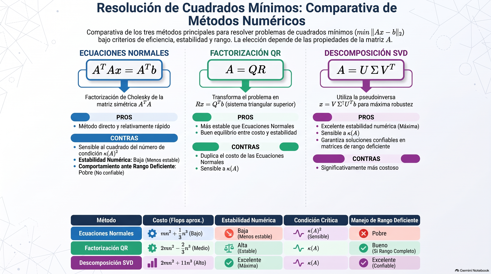

# Análisis Numérico II / Álgebra Lineal Numérica
## Clase 10: Descomposición SVD: Aplicaciones

---

# Los 4 Subespacios Fundamentales

Toda matriz $A \in \mathbb{R}^{m \times n}$ define una transformación lineal entre dos espacios vectoriales fundamentales: el **dominio de entrada** $\mathbb{R}^n$ y el **codominio de salida** $\mathbb{R}^m$.

---

# **Teorema (Descomposición en Valores Singulares)**
Toda matriz real $A \in \mathbb{R}^{m \times n}$ de rango $r$ puede descomponerse en un producto:

$$A = U \Sigma V^T$$

Donde:
- $U \in \mathbb{R}^{m \times m}$ y $V \in \mathbb{R}^{n \times n}$ son ortogonales.
- $\Sigma \in \mathbb{R}^{m \times n}$ es una matriz diagonal de estructura rectangular con valores singulares $\sigma_1 \ge \dots \ge \sigma_r > 0$ y $\sigma_{r+1} = \dots = \sigma_{\min(m,n)} = 0$.

$$\Sigma = \begin{bmatrix} \sigma_1 & & & \\ & \ddots & & \\ & & \sigma_r & \\ & & & 0 \end{bmatrix}$$

---

# Teorema (Eckart-Young)

Sea $A \in \mathbb{R}^{m \times n}$ de rango $r$ y $A = U\Sigma V^T$ su descomposición SVD. Para cualquier $k \in \{1, \dots, r\}$ podemos escribir:

$$ A_k = \sum_{i=1}^k \sigma_i u^i (v^i)^T. $$

Entonces:
- $A_k$ tiene rango $k$ y
- $min\{ \|A - B\|_2 | B \in \mathbb{R}^{m \times n} \text{ de rango } k \} = \|A - A_k\|_2 = \sigma_{k+1}$.

Esto quiere decir que $A_k$ es la mejor aproximación de rango $k$ de la matriz $A$ en términos de la norma 2.

---

# Qué nos dice el Teorema de Eckart-Young?

- Reducir la dimensionalidad de $A$ al "recortar" las componentes menos significativas (valores singulares pequeños) es la mejor manera de aproximar la matriz original.
- Si aplicamos ese procedimiento, el error introducido es el menor posible para el rango de matrices del mismo tamaño.
- Este hecho es muy importante para la disciplina del **Machine Learning** y da lugar al llamado **"Análisis de Componentes Principales"** (PCA).
- También es una forma de **compresión de datos** en imágenes.

---

# Cuadrados Mínimos (again! :D)

$$ \min_x \frac{1}{2}\|Ax - b\|_2^2 $$

- Si nuestra matriz es $m \times n$, con $m > n$ y de rango completo, entonces podemos aplicar QR sin problemas.
- Cuando la matriz tiene rango deficiente ($r < n$), el problema se complica por tener $N(A)$ no trivial. ¿Cómo resolvemos en ese caso?
- Si $x_p$ es una solución de $\arg\min_x \|Ax - b\|_2$, entonces $x_p + z$ **también es solución** para cualquier $z \in N(A)$:
  $$A(x_p + z) - b = (Ax_p - b) + Az = Ax_p - b$$
---

# Cuadrados Mínimos con Deficiencia de Rango

- La solución de cuadrados mínimos **no es única** (existe una familia infinita de soluciones).

> **Fallo de otros métodos:**
> - **Factorización QR ($A = QR$):** La matriz $R$ tendrá ceros en la diagonal (singular, no invertible).
> - **Ecuaciones Normales ($A^T A x = A^T b$):** La matriz $A^T A$ es singular.

---

# Solución de Norma Mínima

Cuando la solución no es única, se añade un segundo criterio para seleccionar una solución particular: la **solución de norma mínima** $x^*$.

Es el único vector $x^*$ que satisface dos condiciones:
1. **Resuelve el problema de Cuadrados Mínimos:** $x^* = \arg\min_x \|Ax - b\|_2$.
2. **Tiene la menor norma 2:** $\|x^*\|_2 \le \|x\|_2$ para cualquier otra solución $x$ de CM.

**Caracterización geométrica:**
Esta condición es equivalente a exigir que la solución sea ortogonal al espacio nulo:
$$x^* \perp N(A) \quad \iff \quad x^* \in \text{rango}(A^T)$$

Esta solución única se calcula de forma estable mediante la **SVD**.

---

# Teorema

La solución de cuadrados mínimos de norma mínima $x^*$ es ortogonal al espacio nulo, $x^* \perp N(A)$.

**Demostración:**
- Sea $S$ el conjunto de todas las soluciones del problema de Cuadrados Mínimos:
   $$S = \{ x_p + z \mid z \in N(A) \}$$
   donde $x_p$ es una solución particular cualquiera.

- Descomponemos $x_p$ en el espacio fila $\text{rango}(A^T)$ y en el espacio nulo $N(A)$:
   $$x_p = x_r + x_n, \quad \text{con } x_r \in \text{rango}(A^T), \; x_n \in N(A)$$

- Reescribimos $S$ absorbiendo $x_n$ en la variable general $z \in N(A)$:
   $$S = \{ x_r + z \mid z \in N(A) \}$$

---

### Demostración

- **Minimización de la norma:** Queremos hallar $\arg\min_{x \in S} \|x\|_2^2$, lo cual equivale a:
   $$\min_{z \in N(A)} \|x_r + z\|_2^2$$

- Como el espacio fila $\text{rango}(A^T)$ y el espacio nulo $N(A)$ son **complementos ortogonales**, $x_r \perp z$ para todo $z \in N(A)$. Por el **Teorema de Pitágoras**:
   $$\|x_r + z\|_2^2 = \|x_r\|_2^2 + \|z\|_2^2$$

- El valor mínimo de $\|z\|_2^2$ es $0$, el cual se alcanza únicamente cuando $z = 0$.

$$\therefore \quad x^* = x_r + 0 = x_r \in \text{rango}(A^T) \quad \implies \quad x^* \perp N(A) \quad \blacksquare$$

---

# Cálculo de $x^*$ mediante SVD

Sea la descomposición $A = U \Sigma V^T$ con $U \in \mathbb{R}^{m \times m}$, $V \in \mathbb{R}^{n \times n}$ ortogonales y $\Sigma = \text{diag}(\sigma_1, \dots, \sigma_r, 0, \dots, 0)$.

Aprovechando que la norma 2 se preserva por transformaciones ortogonales ($\|U y\|_2 = \|y\|_2$):

$$\|Ax - b\|_2^2 = \|U \Sigma V^T x - b\|_2^2 = \|\Sigma (V^T x) - U^T b\|_2^2$$

Definimos $\tilde{x} = V^T x$ y $c = U^T b$. El problema equivale a minimizar:

$$\|\Sigma \tilde{x} - c\|_2^2 = \sum_{i=1}^r (\sigma_i \tilde{x}_i - c_i)^2 + \sum_{i=r+1}^m c_i^2$$

- Para minimizar el residuo, elegimos **$\tilde{x}_i = \frac{c_i}{\sigma_i} = \frac{u_i^T b}{\sigma_i}$** para $1 \le i \le r$.
- El término $\sum_{i=r+1}^m c_i^2$ es el **residuo mínimo ineliminable**.

---

# Solución Final y Pseudoinversa de Moore-Penrose

- Las componentes $\tilde{x}_{r+1}, \dots, \tilde{x}_n$ no afectan el residuo $\|Ax - b\|_2$.
- Para minimizar la norma $\|x\|_2 = \|\tilde{x}\|_2$, elegimos **$\tilde{x}_i = 0$** para $i = r+1, \dots, n$.

Recuperando $x^* = V \tilde{x}$:

$$x^* = \sum_{i=1}^r \frac{u_i^T b}{\sigma_i} v_i$$

### Pseudoinversa de Moore-Penrose ($A^+$)

Definimos $A^+ = V \Sigma^+ U^T$, donde $\Sigma^+ = \text{diag}\left(\frac{1}{\sigma_1}, \dots, \frac{1}{\sigma_r}, 0, \dots, 0\right) \in \mathbb{R}^{n \times m}$.

La **solución única de norma mínima** para cuadrados mínimos viene dada por:

$$x^* = A^+ b$$

---

# Algoritmo **(Cuadrados Mínimos por SVD)**

**Entrada:** $A \in \mathbb{R}^{m \times n}, b \in \mathbb{R}^m$ y tolerancia $\text{tol} \ge 0$. **Salidas:** Solución de norma mínima $x^* \in \mathbb{R}^n$ y residuo mínimo $r_2 = \|Ax^* - b\|_2$.
- $U, \Sigma, V = descomposicion\_SVD(A)$
- $c = U^T b$
- Definir $r = \max\{i: \sigma_i > \text{tol}\}$ *(rango numérico de $A$)*
- Definir $\mathcal{I} = \{1, \dots, r\}, \ \mathcal{J} = \{r+1, \dots, m\}$
- Calcular $y_i = \frac{c_i}{\sigma_i}$ para $i \in \mathcal{I}$, y definir $y = \begin{bmatrix} y_{\mathcal{I}} \\ 0 \end{bmatrix} \in \mathbb{R}^n$
- $x^* = V y$

**Retornar:** $x^*$ y $r_2 = \|c_{\mathcal{J}}\|_2$

---

